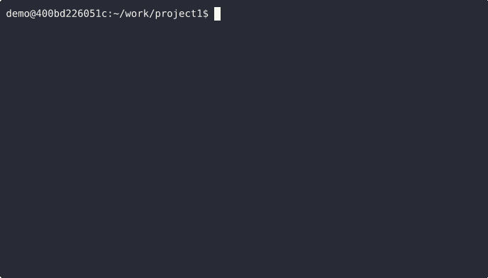

# `ctxhist`

[🇯🇵 日本語版README](docs/README_ja.md)  

> **Re-run past commands in their original context**  
> A context-aware history extension for Bash

---

## 🧠 What is this?

`ctxhist` is more than just a shell history. It records:  
**"When, where, and what you ran"**,  
and allows you to re-run past commands **in the exact directory they were originally executed**.

> ⚠️ Depends on `fzf` – an interactive fuzzy finder for history and command selection.

---

## 🔥 Demo
**Run a past command exactly where you ran it before.**



In this example:

1. You're currently in `/home/demo/work/project1`
1. You press `Ctrl-g Ctrl-r` and select a previous `cargo run` command from `project2` via `fzf`
1. It auto-inserts: `cur=$PWD; cd /home/demo/work/project2 && cargo run; cd "$cur"`
1. The command runs in `project2`, then returns to the original directory
1. You press `Ctrl-g Ctrl-a` and again select the same `cargo run` from `project2`
1. It auto-inserts: `cd /home/demo/work/project2 && cargo run`
1. The command runs and stays in `project2`

---

## 😮 How it's different from normal shell history

| Feature                    | Traditional History (`history` / `Ctrl-r`) | `ctxhist`                      |
|---------------------------|--------------------------------------------|--------------------------------|
| Command search            | ✅ (with `fzf`)                            | ✅ (with `fzf`)                |
| Records working directory | ❌                                         | ✅ (logged every time)         |
| Auto directory switching  | ❌                                         | ✅ (stay/restore modes)        |
| Duplicate removal & limit | ❌ (requires manual config)                | ✅ (built-in)                  |

---

## 📦 Features

- Logs `timestamp / directory / command`
- Fuzzy search with `fzf` across all or filtered directories
- Stay/Restore modes for directory control
- Automatic duplicate removal and log trimming
- Insert commands directly using keybinds

---

## ⌨️ Default Keybindings

| Mode       | All History (global)      | Subdirectory only         |
|------------|----------------------------|----------------------------|
| **stay**   | `Ctrl-g Ctrl-a`            | `Ctrl-o Ctrl-a`            |
| **restore**| `Ctrl-g Ctrl-r`            | `Ctrl-o Ctrl-r`            |

> Example: `Ctrl-g Ctrl-r` → Select via fzf → Temporarily cd & run → Return to original dir

Customizable via environment variables (e.g., `CTXHIST_BINDKEY_STAY`)

---

## ⌨️ Modes Explained

| Mode      | Behavior                          | Example command                                |
|-----------|-----------------------------------|------------------------------------------------|
| `stay`    | Remain in the directory after run | `cd ~/proj && docker up`                       |
| `restore` | Return to original directory      | `cur=$PWD; cd ~/proj && docker up; cd "$cur"` |

---

## 📂 Log Format

Location: `$CTXHIST_LOG_FILE` (default: `~/.config/ctxhist.log`)

```
YYYY-MM-DD HH:MM:SS | /path/to/dir | command here
```

---

## ⚙️ Installation

### 1. Install `fzf`

```bash
sudo apt install fzf  # or brew install fzf on macOS
```

### 2. Clone and configure

```bash
git clone --depth 1 https://github.com/nakkiy/ctxhist.git ~/.ctxhist
```

Add the following to your `.bashrc`:

```bash
export CTXHIST_LOG_FILE="$HOME/.config/ctxhist.log"
export CTXHIST_MAX_LINES=10000
export HISTX_EXCLUDE_CMDS="cd clear ls"
export CTXHIST_BINDKEY_STAY='\C-g\C-a'
export CTXHIST_BINDKEY_RESTORE='\C-g\C-r'
export CTXHIST_BINDKEY_SUBDIR_STAY='\C-o\C-a'
export CTXHIST_BINDKEY_SUBDIR_RESTORE='\C-o\C-r'

source ~/.ctxhist/ctxhist.bash
```

Apply the changes:

```bash
source ~/.bashrc
```

---

## ❌ Uninstall

### 1. Remove the log file

```bash
rm ~/.ctxhist.log
```

### 2. Remove the script and edit `.bashrc`

```bash
rm -r ~/.ctxhist
```

Then remove the following lines from `.bashrc`:

```bash
export CTXHIST_LOG_FILE="$HOME/.config/ctxhist.log"
export CTXHIST_MAX_LINES=10000
export HISTX_EXCLUDE_CMDS="cd clear ls"
export CTXHIST_BINDKEY_STAY='\C-g\C-a'
export CTXHIST_BINDKEY_RESTORE='\C-g\C-r'
export CTXHIST_BINDKEY_SUBDIR_STAY='\C-o\C-a'
export CTXHIST_BINDKEY_SUBDIR_RESTORE='\C-o\C-r'

source ~/.ctxhist/ctxhist.bash
```

Apply the changes:

```bash
source ~/.bashrc
```

### 3. Optional: Remove `fzf`

```bash
sudo apt remove fzf
```

---

## ⚙️ Configurable Environment Variables

| Variable Name               | Description                              | Default Value            |
|----------------------------|------------------------------------------|--------------------------|
| `CTXHIST_LOG_FILE`         | Path to the log file                     | `~/.ctxhist.log`         |
| `CTXHIST_MAX_LINES`        | Max number of lines to keep in log      | `10000`                  |
| `CTXHIST_EXCLUDE_CMDS`     | Commands to exclude (space-separated)    | e.g., `"cd clear ls"`          |
| `CTXHIST_BINDKEY_*`        | Keybindings for each mode               | `\C-g\C-a` etc.         |

---

## 💬 Feedback

If you have feedback, ideas, or run into any issues, feel free to open an [issue](https://github.com/nakkiy/ctxhist/issues/1)!

- Share your impressions or thoughts
- Report bugs or unexpected behavior
- Suggest new features or improvements

English or Japanese — either is welcome!

---

## 🧩 Future Plans

- Possibly release as a Zsh plugin (Oh-My-Zsh compatible)

---

## 📄 License

[MIT License](LICENSE-MIT)

